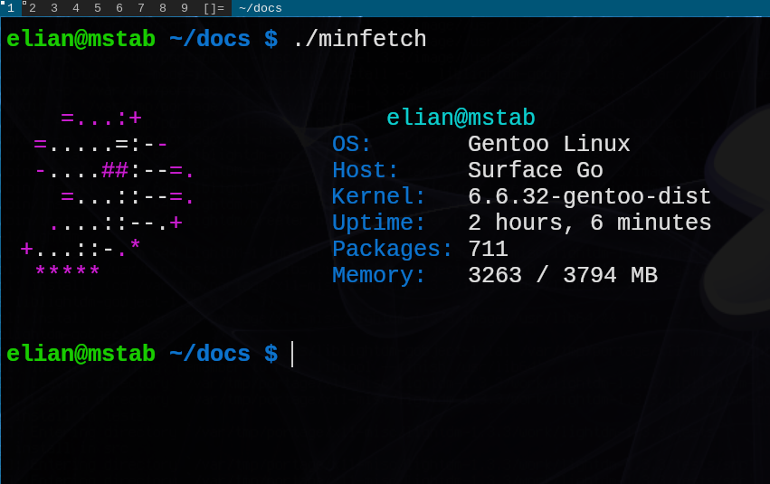

# minfetch - you can't get more minimal
##### what is minfetch

minfetch was built with one goal in mind, NO BLOAT. and we achieved that. 
the minfetch-gen file is a total of 168 lines and the actul minfetch 
program is only 57 lines! although is very bare vones and minimal (it's
in the name) we offer the most cuztimization you can get, pure source 
code changing. we currently only come with two optinal features (technacly 
all the features are optinal), swap detection and cpu detection. 

note: if you want a custom ascii and whatnot you can make your own or, what I recomend, use jp2a or something simular and pipe it to an ascii file and then replace the 'echo "$ascii"' with cat ascii

#### **WARNING:pfetch is farly untested so expecta lot of bugs

